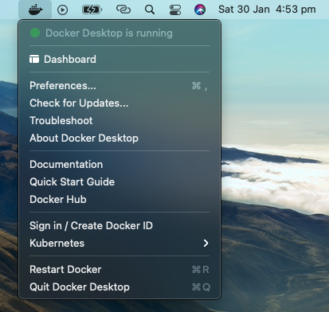
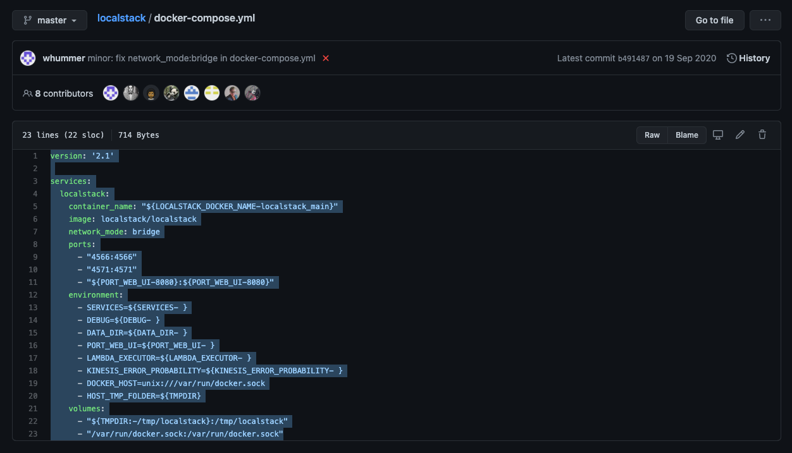
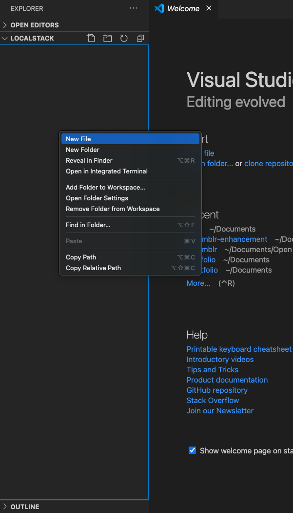
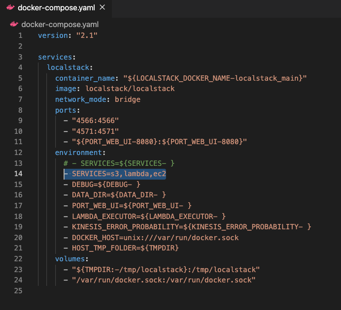
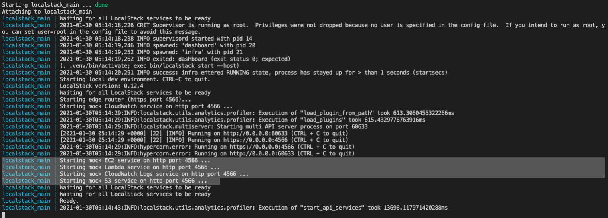

LocalStack is an extremely useful tool if you want to save money and avoid signing into AWS console as much as possible.

Using LocalStack gives you the ability to spin up cloud services directly on your local machine, making it more convenient to develop for the cloud.

I recently discovered LocalStack whilst working on the [Scrumblr-Enhacement project](https://github.com/zainafzal88/scrumblr-enhancement) alongside a group of members from the Dev(){CoP} community. Zain Afzal, our project lead, recommended we use LocalStack in order to simplify development and save cost. 

In this blog, I will show you how to setup LocalStack on your machine, step-by-step.

# Step 1

## Install and Run Docker

Visit [https://hub.docker.com/search?q=&type=edition&offering=community](). 

Search for the Docker download matching your OS and install it accordingly.

Once you have Docker installed, make sure to run the application. If you've installed and run it correctly, you should see the whale icon appear on your tool bar above.



All you have to do is keep it running and proceed to the next step.

# Step 2 

Visit the LocalStack repository on github via
https://github.com/localstack/localstack.

On here, locate a file called 'docker-compose.yaml' and click to open it. You should see a page like below. Highlight all the text shown in this file and copy it to your clipboard.



# Step 3

If you already know what project you'll be using LocalStack for, open up that repository on your favourite IDE. Otherwise, create a test folder anywhere on your machine and open that instead. 

For this tutorial, I will create a folder called 'localstack' on my desktop.

Once you have opened up your IDE with your chosen folder, create a new file in there called 'docker-composer.yaml'



After you've created this file, paste the text you copied earlier and hit save.

# Step 4

Now add the AWS services you plan to use by editing the 'SERVICES' line in the 'docker-compose.yaml' file. As you can see from the image below, I have added s3, lambda and ec2.



# Step 5

Open up the terminal; either through your IDE or directly on your machine. Locate the directory where you have your 'docker-compose.yaml' file stored. You can do this by using the CD command as shown below. 
```console
$ cd Desktop/localstack
```

Once you've done this, type in the following command.
```console
$ docker-compose up
```
You should see a sequence of lines show up in your terminal just like the image shown below. As you can see, the mock services we listed earlier is now running. 



# Step 6
Visit [https://0.0.0.0:4566]() in your browser and you should see a "running" status like below.


Add /health to the end of the previous url and you will see the statuses of each of the services you listed earlier. 

-localstack.png)

# That's It!

You should be all set up and ready to start developing for AWS on your local machine! Hope this helped. If you have any questions or are facing any problems, please do not hesitate to reach out to me. 

# Contact

You can find me at any of the following places!

- Website: [https://thanesh.io/](https://thanesh.io/)
- Email: [thanesh.pannirselvam@gmail.com](mailto:thanesh.pannirselvam@gmail.com)
- LinkedIn: [linkedin.com/in/thanesh-pannirselvam](https://linkedin.com/in/thanesh-pannirselvam)
