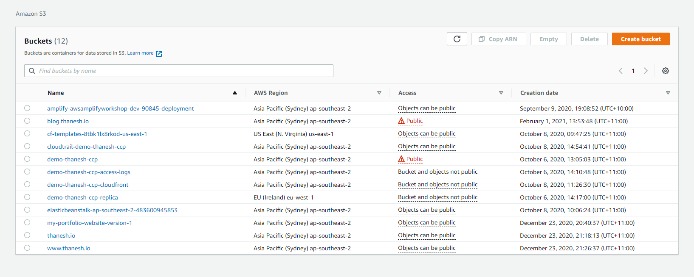
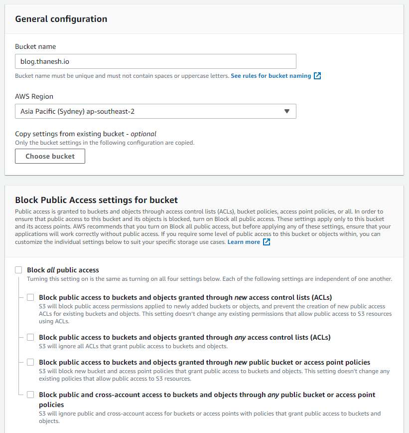
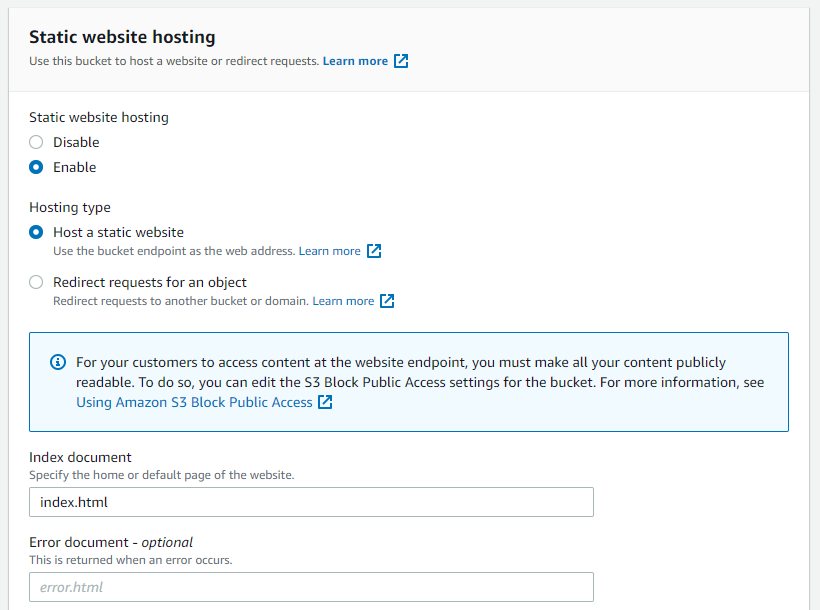
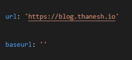
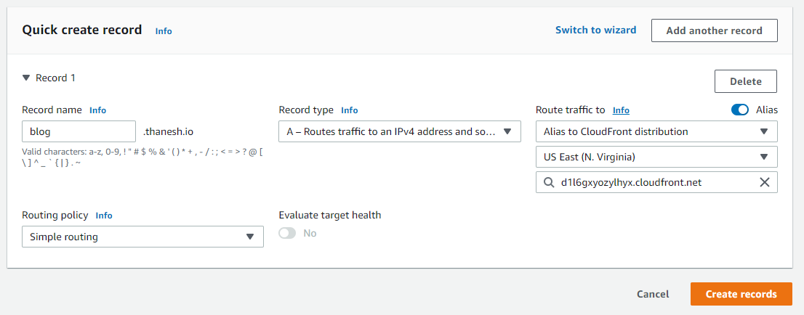

When I was looking to deploy my blog on AWS, I remember searching everywhere for an all-in-one tutorial that covered everything from deployment to domain configuration. However, I couldn't find one to suit exactly what I needed.

After browsing several articles combined with trial and error, I've compiled a set of steps that worked for me. 

In this tutorial, I will show you how to deploy your Jekyll site (or any other static site) on AWS using S3, CloudFront and Route53. Before you get started, this tutorial assumes you already have an AWS account, a Jekyll site and a purchased domain.

# Step 1

## Creating an S3 Bucket 

The first thing you need to do is head into the AWS console, sign-in and click into S3. You should see a page like below, minus the buckets.



Click on 'Create bucket' in the top right hand corner and name your bucket the same as your chosen domain, making sure to choose the region closest to you. Under 'Block Public Access settings for bucket', untick the first checkbox to make this bucket public. Your screen should be similar to below.



Leave the rest of the settings as default and click 'Create Bucket'.

# Step 2 

## Changing the Bucket Policy

Once you've created the S3 Bucket, you'll need to change the bucket policy to provide access to the objects stored in your bucket. 

Navigate to your bucket and click on the 'Permissions' tab. Scroll down to 'Bucket Policy' and click edit. Copy & paste the json code shown below; replacing 'blog.thanesh.io' with your bucket name.

```json 
{
 "Version": "2012-10-17",
 "Statement": [
  {
   "Sid": "AddPerm",
   "Effect": "Allow",
   "Principal": "*",
   "Action": "s3:GetObject",
   "Resource": "arn:aws:s3:::blog.thanesh.io/*"
  }
 ]
}
```

# Step 3 

## Enable Static Hosting

Next, head into the 'Properties' tab and scroll down until you find 'Static website hosting'. Click the 'Edit' button on the top right hand corner and you should be directed to a settings page like below.

On here, we will enable static website hosting and specify the index document. You don't have to change any other settings.



# Step 4

## Deploying Your Website

In this step, we'll be deploying our site by adding it's files into the AWS bucket we created earlier. Just before we do that, however, we have to prepare out Jekyll files to ensure it will deploy correctly on S3. 

Open up your website's repository in your favourite IDE and locate the _config.yml file. In here, change the url to your domain name and the baseurl to an empty string.



After you've changed this, open up your terminal and navigate to the folder of your Jekyll site using the CD command shown below.

```console
$ cd Desktop/jekyll-site
```
Once you've done this, type in the following command to create a production build of your site.

```console
$ bundle exec jekyll build
```

If this has run successfully, you will now see a new folder in your repository called '_site'. Upload the contents of this folder into your S3 bucket by drag and drop or through the 'Upload' function on AWS.

At this point, your site is live. Head into the properties tab, scroll to the bottom and click on the link shown in the 'Static Website Hosting' box. If everything has gone well, you should now see your site.


I suggest copying this url now as we will need it for the next step.

# Step 5

## Enabling CloudFront

Now it's time to set up CloudFront for your website. Essentially, CloudFront distributes your site across AWS edge locations, providing better performance to the end-user.

To get started with setting this up, head into the CloudFront service and click on 'Create Distribution'.

Under 'Origin Domain Name', enter the url you copied earlier, minus the protocol. For example, the link generated for my bucket is http://blog.thanesh.io.s3-website-ap-southeast-2.amazonaws.com. Therefore, the value I'll enter into this field is blog.thanesh.io.s3-website-ap-southeast-2.amazonaws.com. 

It is important you do not select from one of the options given in the drop down, otherwise, this will not work. You'll have to copy and paste the url as I've described above.


You can keep most of the settings as their default. However, under 'Alternate Domain Names', you'll want to enter your registered domain name. Next, scroll to the bottom and hit "Create Distribution'. This could take about 10-15 minutes to be deployed.

# Step 6 

## Linking up your Domain

By this stage, you should have your website deployed and set up with CloudFront. In this final part, we'll work through setting up your domain so that people know how to access your site.

Firstly, head into Route53, click on 'Hosted Zones' from the left hand column and then create a hosted zone by entering your chosen domain.

Once you've created this, you should see a NS record appear. Copy each of the values from this field and enter it into your domain provider. Essentially, this will allow Route53 to handle the configuration of the domain.

Next, while in your hosted zone, click on 'Create Record'. Here we want to connect our domain with our CloudFront distribution we created earlier. Make sure it is an 'A record' and click on the 'Alias' switch in the right hand corner. In the dropdown that appears, select 'Alias to CloudFront distribution' which prefills the region to 'US East (N. Virginia). Click into the search box and select the CloudFront distribution we made from before. 



Hit 'Create Record' and you're all set! Be patient as it may take a couple of hours to set in. 

# Step 7

## Redirection for WWW and SSL

At this point your site should be up and live. However, if you type in www. before your domain, it will produce an error. 

Fixing this is similar to the process we’ve just done, with a few minor adjustments. You'll want to go back and follow the steps from before but when creating another bucket, you'll want to prepend it with 'www' and under 'Static Website Hosting', choose the 'Redirect' option - setting it your domain. In this bucket, you don't have to add any files as it is purely for redirection. 

After this, setup another CloudFront distribution linking to your 'www' bucket. Add another 'A record' in your hosted zone and set the Alias Target to your new CloudFront url.

As a final note, if you want to setup SSL, go back into the CloudFront distributions you created earlier and find the SSL Certificate option. Under here, choose the 'Custom SSL Certificate' option and click on 'Request or Import a Certificate with ACM'. This is fairly straightforward, especially if your domain is already setup in Route53.

# That's It!

Well Done! Your site is up and live, I hoped this helped you. I'm sure there's other ways to publish a Jekyll site but this is what worked for me. If you have any questions or are facing any problems, please do not hesitate to reach out to me - I am always happy to help!

# Contact

You can find me on any of the following places!
- Website: [https://thanesh.io/]()
- Email: [thanesh.pannirselvam@gmail.com]()
- LinkedIn: [linkedin.com/in/thanesh-pannirselvam](https://linkedin.com/in/thanesh-pannirselvam)
