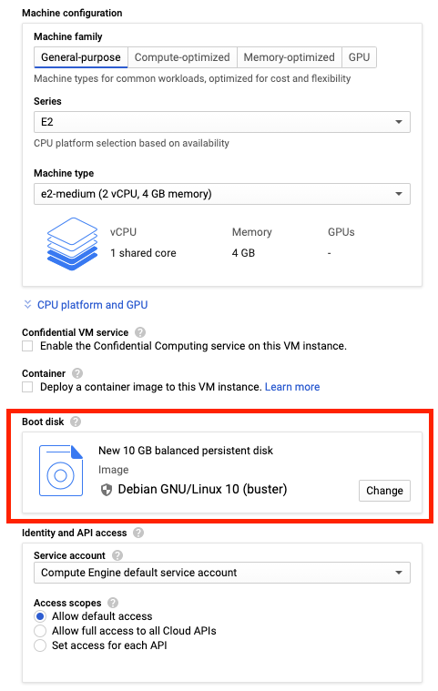
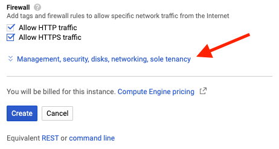
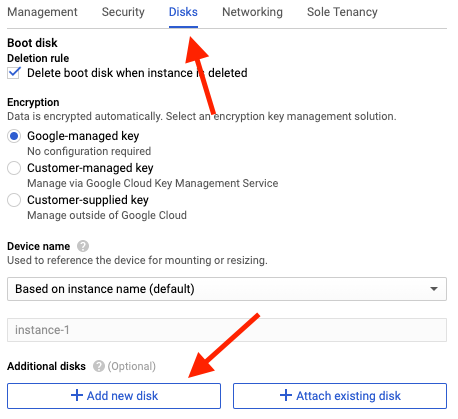

Recently, I decided to learn about Docker and how it can be used to minimize the use of our infrastructure's capacity. In a nutshell, Docker allows us to make better use of our hardware whilst ensuring our application runs on any OS.

In this tutorial, I will walkthrough step-by-step on how you can get Docker setup on a GCP VM instance so that you can run your own containerized applications.

Before you get started, this tutorial assumes you have some basic GCP knowledge, a Google Cloud account and an existing project already setup.

# Step 0

## Log onto the GCP console and navigate to Compute Engine


# Step 1

## Create a VM instance

Once you've navigated to Compute Engine, click on the 'CREATE INSTANCE' button on the top.


Here, we'll be leaving most of the configurations as the default but changing the OS and adding an extra disk.

Scroll down to 'Boot disk' and click on 'Change'.



Select the following options: <br>
**Operating System:** Ubuntu <br>
**Version:** Ubuntu 20.04 LTS <br>
**Boot disk type:** Balanced persistent disk <br>
**Size (GB):** 10

Next, scroll all the way to the bottom and select <u>'Management, security, disks, networking, sole tenancy'</u>.

***Optional:** You can enable HTTP and HTTPS traffic as shown below if you are planning to setup a web-server.*



Click on the 'Disks' option and select '**+** Add new disk'. You can keep most of the configurations as the default. The only thing I'd consider changing is the '**Name**' and '**Size (GB)**'. I'll be making my disk size 50 GB.



Once you're satisfied with your instance, click on the 'Create' button down the bottom. Give Google Cloud a few minutes to have your instance up and running. Wait for this to finish before moving on to the next step.

# Step 2

## SSH into the instance

Now that you have the instance running, it's time to SSH into the instance and start setting up Docker.

There's a couple of ways to SSH into the instance. For this tutorial, I will use the browser option by clicking on the SSH button from the GCP console.


# Step 3

## Make sure you have no versions of Docker installed

Once you've SSH'd into the instance, we want to ensure that we have no versions of Docker installed.

The command shown below will remove any versions of Docker you already have installed if there are any present. Copy/paste this command into your instance's CLI.

```bash
$ sudo apt-get remove docker docker-engine docker.io containerd runc
```

# Step 4

## Installing Docker

Now it's time to install Docker. The first thing you'll have to do is add Docker's official GPG signing key. This is used to ensure that the package we are getting is valid.

```bash
$ curl -fsSL https://download.docker.com/linux/ubuntu/gpg | sudo gpg --dearmor -o /usr/share/keyrings/docker-archive-keyring.gpg
```
Next, add Docker's official stable repository using the following command.

```bash
$ echo \
  "deb [arch=amd64 signed-by=/usr/share/keyrings/docker-archive-keyring.gpg] https://download.docker.com/linux/ubuntu \
  $(lsb_release -cs) stable" | sudo tee /etc/apt/sources.list.d/docker.list > /dev/null
```

Now that we have the repository setup, we are ready to install Docker Engine. To do this, run the following 2 commands. The first command will refresh the apt cache, while the second will install Docker community edition on our instance.

```bash
$ sudo apt-get update
$ sudo apt-get install docker-ce docker-ce-cli containerd.io
```

# Step 5

## Check if Docker has been installed correctly

There are a few ways we can see if Docker has been installed correctly. 

The first thing we can do is run the following commands to check the status and the version installed.

```bash
$ sudo systemctl status docker
$ docker --version
```

Next, login as the root user and give permission to the current user to be able to run docker commands. Replace ${USER} with your username.


```bash
$ sudo -i
$ sudo usermod -aG docker ${USER}
```

Finally, log back in as the previous user and run your first container using the following commands.


```bash
$ su - ${USER}
$ docker run hello-world
```

At this point, you should see the "Hello from Docker!" message as shown below. If you don't see this message, check that you have given permissions to the current user; otherwise, re-visit the previous steps and see if you've missed anything.


# That's It!

Well done! You should now have Docker setup on your VM instance and can start running containerized applications in the cloud. 

Keep in mind that if you decide to run a web-server such as Apache/Nginx in a container, ensure to check firewall rules. Otherwise, you will not see anything when attempting to connect via HTTP/HTTPS.

If you have any questions about this tutorial, feel free to let me know!

# Contact

You can find me on any of the following places!
- Website: [https://thanesh.io/]()
- Email: [thanesh.pannirselvam@gmail.com]()
- LinkedIn: [linkedin.com/in/thanesh-pannirselvam](https://linkedin.com/in/thanesh-pannirselvam)


